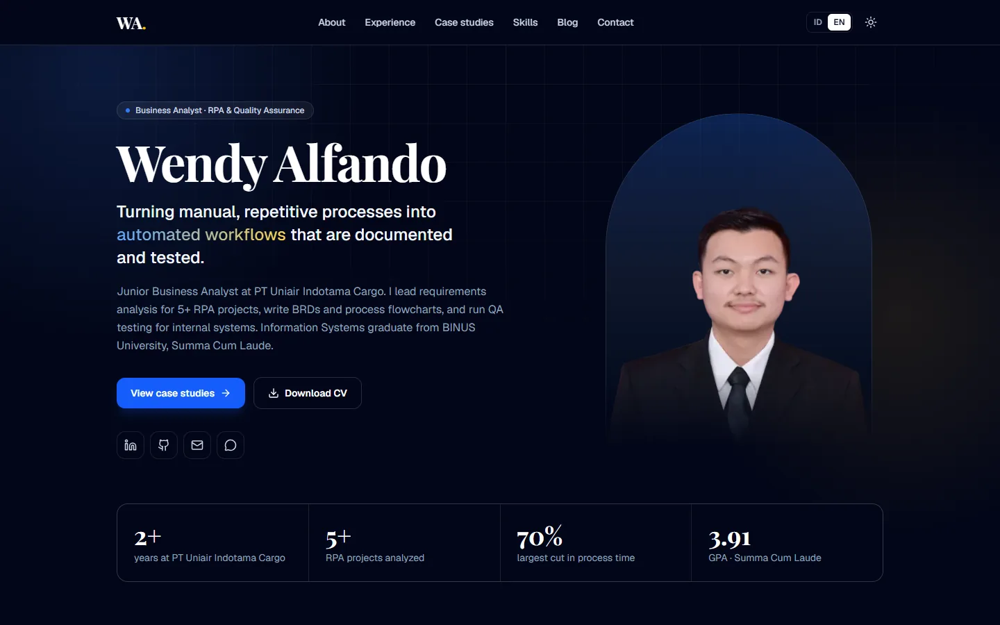

# Wendy Alfando — Portfolio

Personal portfolio of **Wendy Alfando**, Business Analyst (RPA & Quality Assurance) at PT Uniair Indotama Cargo.

**Live:** https://wendyalfando-portfolio.vercel.app



## Highlights

- Bilingual: Indonesian (`/id`) and English (`/en`), both rendered on the server with `hreflang` alternates
- Fully static: every page and social sharing image is generated at build time
- Case-study layout for projects, plus a Markdown blog
- SEO: canonical URLs, sitemap, robots.txt, JSON-LD (`Person`, `BlogPosting`) and generated Open Graph images
- Motion: splash screen, staggered hero load-in, particle background, typing effect, scroll-linked progress and reveals, count-up metrics, filling skill bars, 3D tilt cards, custom cursor and a circular theme switch; all of it turns off with `prefers-reduced-motion`
- Accessible: skip link, labelled controls, visible focus, content never hidden behind JavaScript
- Dark and light themes
- End-to-end tests with Playwright on desktop and mobile viewports

## Tech stack

Next.js 16 (App Router, React Server Components) · React 19 · TypeScript · Tailwind CSS 4 · next-themes · react-markdown · Playwright · Vercel

## Project structure

The app lives in [`next-portfolio/`](next-portfolio):

| Path | Contents |
| --- | --- |
| `src/content/dictionaries/id.ts`, `en.ts` | All page copy, one file per language |
| `src/content/profile.ts` | Contact links, CV and certifications (same in every language) |
| `src/content/blog/*.md` | Blog posts; frontmatter needs `title`, `date`, `lang`, and optionally `excerpt` and `tags` |
| `src/app/[lang]/` | Pages, the root layout and Open Graph images |
| `src/components/` | Layout and section components |
| `tests/` | Playwright smoke tests |

## Run locally

```bash
cd next-portfolio
npm install
npm run dev
```

Then open http://localhost:3000, which redirects to `/id` or `/en` based on the browser language.

## Checks

```bash
npm run lint
npm run typecheck
npm run build
npm run test:e2e
```

`test:e2e` runs against the production build and uses the Microsoft Edge already installed on the machine. Set `PW_CHANNEL=chrome` to use Chrome, or `BASE_URL=https://...` to test a deployed site.

## Deployment

Deployed on Vercel with the project's root directory set to `next-portfolio`. Canonical URLs follow Vercel's production domain automatically; set `NEXT_PUBLIC_SITE_URL` to override it.
